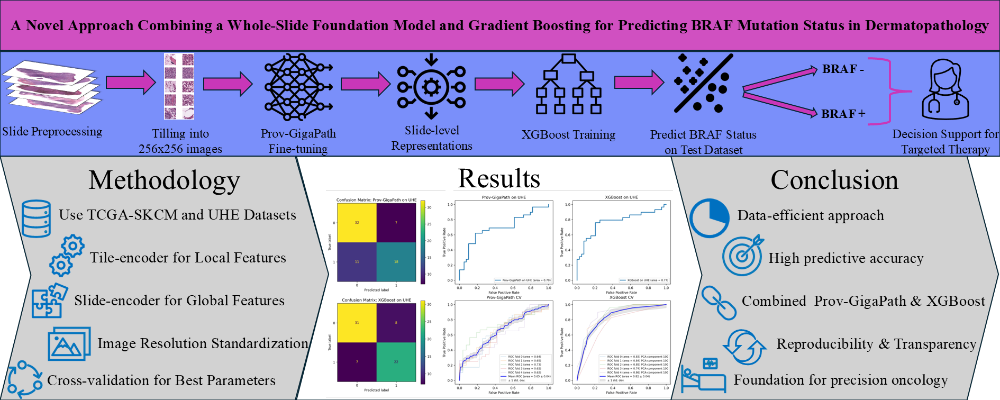

# A Novel Approach Combining a Whole-Slide Foundation Model and Gradient Boosting for Predicting BRAF Mutation Status in Dermatopathology



## Overview

This repository contains the code and experiments for our paper:

> **"A Novel Approach Combining a Whole-Slide Foundation Model and Gradient Boosting for Predicting BRAF Mutation Status in Dermatopathology"**

Our project leverages a state-of-the-art foundation model (Prov-GigaPath) along with a gradient boosting classifier to predict the BRAF mutation status from histopathology whole-slide images. The code is organized to:
- Segment tissues in slides.
- Tile slides dynamically to match a required microns-per-pixel (MPP), with Prov-GigaPath pretrained on mpp=0.5.
- Generate tile embeddings and slide representations.
- Train and evaluate models (using cross-validation on TCGA data and testing on UKE or other datasets).
- Perform hyperparameter tuning and further traditional machine learning experiments with XGBoost.

## Installation

### Requirements

- **Hardware:** GPU machine with CUDA toolkit enabled.
- **Software:** Linux (or similar environment)

### Steps

1. **Clone the Repository**
   ```bash
   git clone https://github.com/MohAlbahr/BRAF-Prediction
   cd BRAF-Prediction
   ```
Create and Activate Conda Environment

```bash
conda env create -f environment.yaml
conda activate provPath
Download the Prov-GigaPath Model
```
The Prov-GigaPath models are available on the HuggingFace Hub.
To download the models, you must agree to the terms. Then, set your HuggingFace read-only token as an environment variable:

```bash
export HF_TOKEN=<your_huggingface_read_only_token>
```
If you don’t set the token, you may encounter the following error:
```bash
ValueError: We have no connection or you passed local_files_only, so force_download is not an accepted option.
```

Further instructions are available on the Prov-GigaPath GitHub page.

## Data Processing
We use two primary datasets:

TCGA: Used for training.
UKE (or any other test dataset): Used for testing.
Tissue Segmentation & Tiling
Segment Tissues and Generate Masks

Run the following script to segment tissues and tile the slides based on a threshold method. This process dynamically computes the tile size (to match mpp=0.5) and saves the coordinates (masks) of the tissue tiles in the prov-gigapath/braf-provpath/Libraries/DataPreparation/index folder.

For TCGA training data:
```bash
python prov-gigapath/braf-provpath/Libraries/DataPreparation/DataTCGA.py
```

For test datasets (e.g., UKE):
```bash
python prov-gigapath/braf-provpath/Libraries/DataPreparation/DataUKE.py
```

This process produces files like tcga_all_masks.pkl that will later be used to load the tiles on the fly without saving individual tile images.

## Generate Tile Embeddings

To generate tile embeddings (i.e., compute a feature vector for each tile) and save all tiles for a given slide into one H5 file, run:

```bash
./prov-gigapath/scripts/run_generate_tile_embeddings.sh
```
Note: For the TCGA dataset, this script may produce around 21 GB of data, so ensure you have enough storage space.

## Training and Testing
### Prov-GigaPath Training

Different training scripts are provided for various scenarios:

### Cross-Validation on TCGA Only:
```bash
./prov-gigapath/scripts/run_train_prov_CV_only_TCGA.sh
```

Train on TCGA and Test on UKE (or other test dataset): Use the provided training script (with or without validation data) as described in the manuscript. For example:
```bash
./prov-gigapath/scripts/run_train_prov_CV_only_TCGA.sh
```
(Check the script for details—there might be separate versions for training with and without validation data.)

## Generate Slide Representations:
To generate slide-level representations using the finetuned Prov-GigaPath model from a checkpoint:
```bash
./prov-gigapath/scripts/run_generate_slide_representations_for_all.sh
```
## XGBoost Experiments
For the traditional machine learning experiments using slide representations:
Hyperparameter Search with Optuna:
```bash
./xgboost/scripts/run_xgboost_hyperparamSearch.sh
```
Train XGBoost on Slide Representations:
```bash
./xgboost/scripts/run_training_XGBoost.sh
```

# Acknowledgements
We would like to express our gratitude to the authors and developers of the Prov-GigaPath foundation model. Their work has been fundamental to this project.

Feel free to adjust the details as necessary, and refer to individual script comments for more in-depth information on each component. Enjoy exploring the project!

